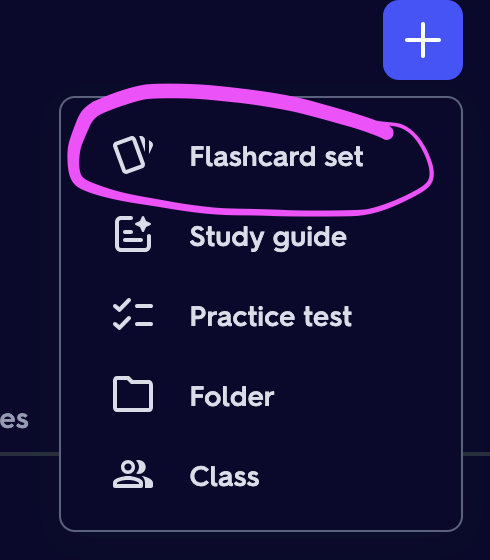

<!-- vim-markdown-toc GFM -->

    * [Flash cards](#flash-cards)
* [How to add one of these flash card sets to Quizlet Tutorial](#how-to-add-one-of-these-flash-card-sets-to-quizlet-tutorial)
* [Languages](#languages)
    * [Dutch](#dutch)
    * [German](#german)
    * [Spanish](#spanish)
    * [Japanese](#japanese)
    * [Computer Science](#computer-science)

<!-- vim-markdown-toc -->

## Flash cards

Find the Quizlet forms of my cards [here!](https://quizlet.com/Eingabeaufforderung/folders) This Github repo will be more up-to-date though.

**These flash cards are stored in text files in the format `term|definition`. Feel free to write your own code that parses them and quizzes you.
I have gotten the vocab from other places naturally, I can't conjure up vocab for languages I'm learning, but I have also tried my best to alter them to fit me the best (e.g adding the feminine versions of adjectives and jobs for Spanish)**

For my own version of this that redoes quizlet write in my own style, check out [quizlet-write](https://github.com/RubberDuckCollector/quizlet-write)!

**If you find an error, submit a pull request and I'll try to figure out how that works and fix the error**

# How to add one of these flash card sets to Quizlet Tutorial

1. Create your flash card set on Quizlet if you haven't already.

1. To add one of these flash card sets to quizlet, first click on the file.

1. Click on the "copy raw file" button in the top right of the file viewer.

1. On Quizlet, click on "Import"

1. Paste the raw file contents into your flash card set.
1. Edit the "Custom" field under "Between Term and Definition" to be a | character.

1. Click "Import" in the bottom right.

1. Give the flash card set a name.
1. Done! 

# Languages

- My flash card sets are more suited to me than the ones in the textbook for my flash card learning technique, and that might also be the case with other people.
    - e.g in spanish, the masculine + feminine forms of each adjective are in my cards in a more explicit format compared to the textbook
    - the male + female versions of nouns like *jefe* and *jefa* are actually in there in my flash cards, whereas the Spanish textbooks I've made the cards from don't have them written down
    - this makes it easier to recall feminine versions of words because they are given equal significance in the flash card set, which is not the case in the textbooks, making my flash cards more usable

## Dutch

- Flash cards:
    - Cannot find any active GCSE or A level courses on Dutch in the UK. The closest I can find is an old OCR course however I haven't found any textbooks and the course was discontinued just before the switch from A*-U to 9-1.
    - Have fun with a sparratic mix of topics
    - Dutch flash cards have plurals for all nouns because it's a bit confusing

## German

- Flash cards:
    - GCSE:
        - From AQA GCSE German Higher 9-1 (ISBN: 978-0-19-836587-7)
    - A Level:
        - AS:
            - From AQA A Level Year 1 and AS German (ISBN: 978-0-19-836689-8)
        - A2:
            - From AQA A Level Year 2 German (ISBN: 978-0-19-836686-7)
    - University: 
        - Year 1/2: from Wie Geht's 10th edition
            - **If an adjective such as „letzt-” is written with a - on the end, it means you add the conjugation as necessary. E.g: „letzte Woche”**

## Spanish

- Flash cards:
    - GCSE:
        - From AQA GCSE Spanish Higher 9-1 (ISBN: 978-0-19-836585-3)
    - A Level:
        - AS:
            - From AQA A Level Year 1 and AS Spanish (ISBN: 978-0-19-836690-4)
        - A2:
            - From AQA A Level Year 2 Spanish (ISBN: 978-0-19-836687-4)
            - Réquiem cards slightly adapted where I think I've made them more usable for this quizlet-style setting (ISBN: 978-0-7190-3222-6)
                - **note: these spanish words are from the 30s and some are archaic (or at least may have old spelling)**

## Japanese
- Flash cards:
    - From the Marugoto textbooks
    - [Link I used to get the marugoto vocab lists](https://words.marugotoweb.jp/mylist_top.php?lv=A1&lang=en)

## Computer Science

- GCSE:
    - From OCR GCSE Computer Science 9-1 J277
- A level:
    - AS:
        - From OCR H046
    - A2:
        - From OCR H446

    
Technical note:

    I didn't use JSON to store the flash cards because the <code>term|definition</code> is sufficient, and it's so simple it's easily machine-readable by simple program code.
    It's also quicker to write the flash cards in this format, and I could make vim remaps to easily find the | and put extra data in the flash card with just 1 keystroke; <code>(reflexive)</code> and <code>(starts with <letter>)</code>. Writing with remaps and vim is much quicker than on the quizlet webiste at least

